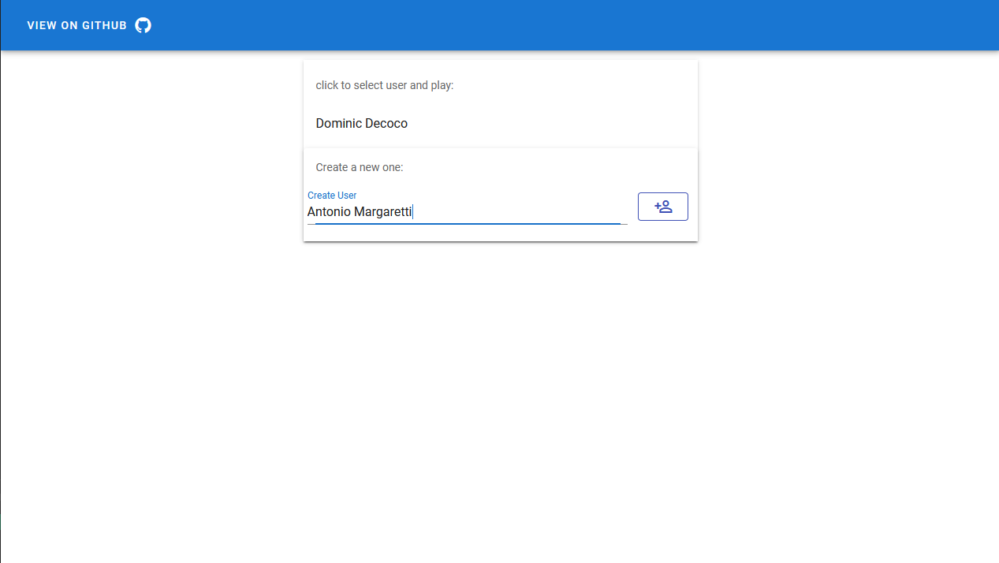
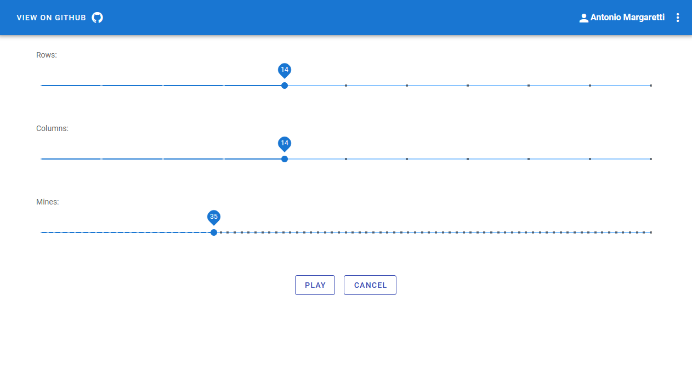
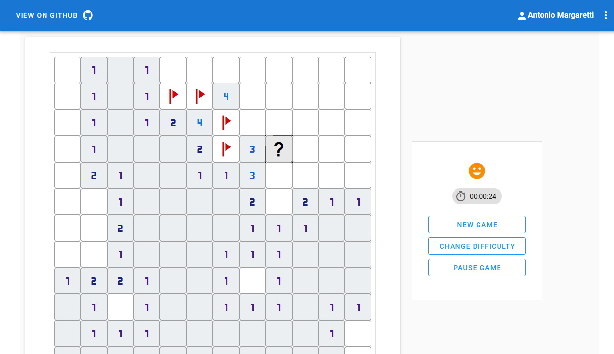

# minesweeper-client

minesweeeper client for the [minesweeper-Api](https://github.com/pablogarzon/minesweeper-Api)

## Game play considerations
- The first cell revealed cannot be mined
- There is no time limit on game play
- User needs to enter his name first to play


## Technology stack
- VueJs
- Vuetify
- Axios

## Project setup
```
npm install
```

### Compiles and hot-reloads for development
```
npm run serve
```

### Compiles and minifies for production
```
npm run build
```

### Lints and fixes files
```
npm run lint
```

### Customize configuration
See [Configuration Reference](https://cli.vuejs.org/config/).

## Play
You can play a little bit [here](https://minesweeper-client-pg.herokuapp.com)

### Screenshots



